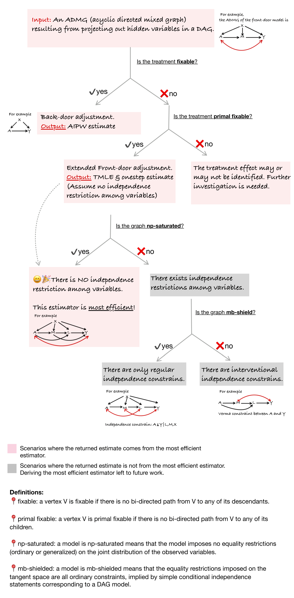
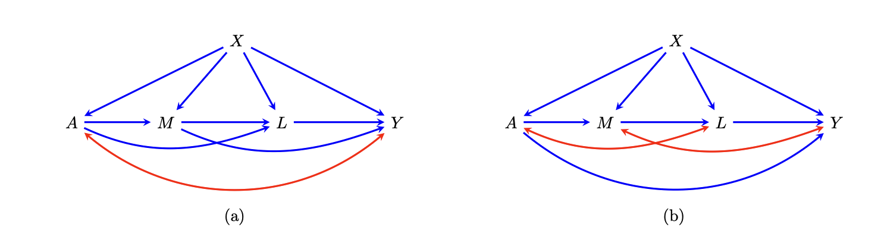

This package is built for estimating the Average Causal Effect (ACE) in graphical models with unmeasured variables. This package is an implementation of the proposed estimators by \red{XXX}, based on the theory of influence functions and targeted minimum loss based estimation (TMLE).





If you find this package useful, please cite: [this paper](http://www.arxiv.org/pdf/2409.03962)
```{r, eval = FALSE, citation}
## placeholder for citation
```

Graphical models with unmeasured variables can be depicted via the Acyclic Directed Mixed Graphs (ADMG). For example, consider the following ADMG, where $A$  is the treatment variable and $Y$ is the outcome variable:



# Installation
To install, run the following code in terminal:

```{bash, eval = FALSE}
# install the devtools package first if it's not yet installed
devtools::install_github("annaguo-bios/flexCausal")
```

The source code for `flexCausal` package is available on GitHub at [flexCausal](https://github.com/annaguo-bios/flexCausal/tree/main).

# Quick Start
The main function in this package is `ADMGtmle()`, which estimates the Average Causal Effect (ACE) using both TMLE esetimator and onestep estimator in graphical models with unmeasured variables. To get a flavor of how to use this package, we provide a quick example below:

```{r, quick-start, warning=F, message=F}
library(flexCausal) # load the package
head(data_fig_4a) # take a glance of the data, which is a simulated dataset under above figure (a).

est <- ADMGtmle(a=c(1,0),data=data_fig_4a, vertices=c('A','M','L','Y','X'),
                bi_edges=list(c('A','Y')),
                di_edges=list(c('X','A'), c('X','M'), c('X','L'),c('X','Y'), c('M','Y'), c('A','M'), c('A','L'), c('M','L'), c('L','Y')),
                treatment='A', outcome='Y',
                multivariate.variables = list(M=c('M.1','M.2')))
```

The code above estimates the ACE of treatment $A$ on outcome $Y$, defined as $E(Y^1)-E(Y^0)$, using the data `data_fig_4a` generated based on Figure (a). The function `ADMGtmle()` takes the following arguments:
  
- `a`: a vector of length 2, specifying the values of treatment $A$ to compare. For example, `a=c(1,0)` compares causal effect under $A=1$ verse $A=0$.
- `data`: a data frame containing the data.
- `vertices`: a vector of strings, specifying the names of all vertices in the ADMG.
- `bi_edges`: a list of bi-directed edges in the ADMG.
- `di_edges`: a list of directed edges in the ADMG. For example, `c('X','A')` specifies an edge from $X$ to $A$.
- `treatment`: a string, specifying the name of the treatment variable.
- `outcome`: a string, specifying the name of the outcome variable.
- `multivariate.variables`: a list of variables that are multivariate. For example, `list(M=c('M1','M2'))` specifies that $M$ is a multivariate variable with components $M1$ and $M2$.

# Estimation via TMLE estimator and onestep estimator

## The Onestep Estimator
In implementing the onestep estimator, we use the trick of sequential regression. For example, in the above example (a), the onestep estimator involves a nuisance $E\left[E(Y|L, M,a_1,X)\right | M,a_0,X]$, where $a_1=1-a$, $a_0=a$, and $a$ is the level of intervention of treatment $A$. To estimate this nuisance, we would first fit a regression model of $Y$ on $L, M, A, X$ to get and estimate $\hat{E}(Y|L, M,a_1,X)$ and then fit a regression model of $\hat{E}(Y|L, M,a_1,X)$ on $L, M, A, X$. We offer three options for the regression model: (1) via simple linear or logistic regression, (2) via SuperLearner, and (3) via SuperLearner together with cross-fitting. Below we elaborate on the three options:
  
- Option 1: Simple linear or logistic regression. The function offers `formulaY` and `formulaA` to specify the regression model for the outcome regression and propensity score regression, respectively. It further allow users to specify the link function for the outcome regression and propensity score regression via `linkY_binary` and `linkA`, respectively. Note that `linkY_binary` is only effective when the outcome is a binary variable.
- Option 2: SuperLearner. The function offers `superlearner.seq`, `superlearner.Y`, and `superlearner.A`, to specify whether to use SuperLearner for the sequential regression, outcome regression, and propensity score regression, respectively. The user can further specify the library of SuperLearner via `library.seq`, `library.Y`, `library.A`, respectively.
- Option 3: SuperLearner with cross-fitting. The function offers `crossfit` to specify whether to use cross-fitting in SuperLearner. The user can further specify the number of folds in cross-fitting via `K`. The library of SuperLearner is still specified via `library.seq`, `library.Y`, `library.A`, respectively.

The code below is an example of adopting SuperLearner with cross-fitting:

```{r, onestep-eg, warning=F, message=F, eval=F}

est <- ADMGtmle(a=c(1,0),data=data_fig_4a, vertices=c('A','M','L','Y','X'),
                bi_edges=list(c('A','Y')),
                di_edges=list(c('X','A'), c('X','M'), c('X','L'),c('X','Y'), c('M','Y'), c('A','M'), c('A','L'), c('M','L'), c('L','Y')),
                treatment='A', outcome='Y',
                multivariate.variables = list(M=c('M1','M2')),
                lib.seq = c("SL.glm", "SL.earth", "SL.ranger", "SL.mean"),
                lib.Y = c("SL.glm", "SL.earth", "SL.ranger", "SL.mean"),
                lib.A = c("SL.glm", "SL.earth", "SL.ranger", "SL.mean"),
                crossfit = TRUE,
                K=5)
```

## The TMLE
In implementing the TMLE estimator,apart from sequential regression, we also need to estimate density ratios. For example, in the above example (a), the TMLE estimator involves a nuisance $p(M|a_0,X)/p(M|a_1,X)$. We need to estimate the density ratio for two sets of variables. Let $C$ be the set of pre-treatment variables, let $L$ be the set of variables that are connect with treatment $A$ via bidirected edges, and let $M$ be the set of variables that is not in either $C$ or $L$. We need to estimate the density ratio for variables in $L\backslash A,Y$ and $M\backslash Y$. We offer three options for the density ratio estimation: (1) via the \link[densratio]{densratio} package, (2) via Bayes rule, and (3) via assuming normal distribution for continuous varialbes. Below we elaborate on the three options:
 
- Option 1: The \link[densratio]{densratio} package. The function calls the \link[densratio]{densratio} package to estimate the density ratio for variables in $L\backslash A,Y$ or $M\backslash Y$ if `ratio.method.L="densratio"` or `ratio.method.M="densratio"`, respectively.
- Option 2: Bayes rule. The function estimates the density ratio for variables in $L\backslash A,Y$ or $M\backslash Y$ via Bayes rule if `ratio.method.L="bayes"` or `ratio.method.M="bayes"`, respectively. For example, the bayes rule method estimate $p(M|a_0,X)/p(M|a_1,X)$ by rewriting it as $[p(a_0|M,X)/p(a_1|M,X)]/[p(a_0|X)/p(a_1|X)]$. $p(A|M,X)$ is then estimated via the three options as discussed under the onestep estimator section. We use `superlearner.M` and `superlearner.L` to specify whether to use SuperLearner for the density ratio estimation for variables in $M\backslash Y$ and $L\backslash A,Y$, respectively. The user can further specify the library of SuperLearner via `lib.M` and `lib.L`, respectively.
- Option 3: Assuming normal distribution for continuous variables. The function estimates the density ratio for variables in $L\backslash A,Y$ or $M\backslash Y$ via assuming normal distribution if `ratio.method.L="dnorm"` or `ratio.method.M="dnorm"`, respectively. The mean of the normal distribution is estimated via linear regression, and the variance is estimated via the sample variance of the error term from the regression model. Note that we assume the linear regression only involve first order terms, and we do not consider interaction terms.

The code below is an example of using the `dnorm` method for the density ratio estimation for variables in $M\backslash Y$:

```{r, tmle-eg, warning=F, message=F, eval=F}

est <- ADMGtmle(a=c(1,0),data=data_fig_4a, vertices=c('A','M','L','Y','X'),
                bi_edges=list(c('A','Y')),
                di_edges=list(c('X','A'), c('X','M'), c('X','L'),c('X','Y'), c('M','Y'), c('A','M'), c('A','L'), c('M','L'), c('L','Y')),
                treatment='A', outcome='Y',
                multivariate.variables = list(M=c('M1','M2')),
                ratio.method.M = "dnorm")
```

# Output
As an example, we `ADMGtmle()` to estimate the average counterfactual outcome $E(Y^1)$. The output is described as follows

```{r, output, eval=F}

est <- ADMGtmle(a=1,data=data_fig_4a, vertices=c('A','M','L','Y','X'),
                bi_edges=list(c('A','Y')),
                di_edges=list(c('X','A'), c('X','M'), c('X','L'),c('X','Y'), c('M','Y'), c('A','M'), c('A','L'), c('M','L'), c('L','Y')),
                treatment='A', outcome='Y',
                multivariate.variables = list(M=c('M1','M2')))

# TMLE and Onestep estimator
est$TMLE # a list contains the estimation result from TMLE estimator
est$Onestep # a list contains the estimation result from Onestep estimator

# For either the TMLE or Onestep estimator, the output is a list that contains the following elements:
est$TMLE$estimated_psi # the estimated average counterfactual outcome
est$TMLE$lower.ci # the lower bound of the 95% confidence interval
est$TMLE$upper.ci # the upper bound of the 95% confidence interval
est$TMLE$EIF # the estimated efficient influence function
est$TMLE$EIF.Y # the estimated efficient influence function at the tangent space associated with the outcome
est$TMLE$EIF.A # the estimated efficient influence function at the tangent space associated with the treatment
est$TMLE$EIF.v # the estimated efficient influence function at the tangent space associated with the rest of the variables
est$TMLE$p.a1.mpA # the estimated propensity score for treatment
est$TMLE$mu.next.A # the estimated sequential regression associated with variable that comes right after the treatment according to the topological ordering of the ADMG
est$TMLE$EDstar # mean of the estimated efficient influence function
est$TMLE$iter # iterations take for TMLE estimator to converge
est$TMLE$EDstar.record # the mean of the estimated efficient influence function at each iteration

```

# Functions for learning the properties of ADMG
Apart from the `ADMGtmle()` for causal effection estimation, we also provide functions for learning the properties of ADMG. The functions are described as follows:
  
- `make.graph`: create the graph object. For example, to create the graph object for the ADMG in Figure (a), we can use the following code:

```{r, make-graph, warning=F, message=F, eval=F}

graph <- make.graph(vertices=c('A','M','L','Y','X'),
bi_edges=list(c('A','Y')),
di_edges=list(c('X','A'), c('X','M'), c('X','L'),
c('X','Y'), c('M','Y'), c('A','M'), c('A','L'), c('M','L'), c('L','Y')))

```

- `f.adj_matrix`: return the adjacency matrix of the graph. For example, to get the adjacency matrix of the graph object for the ADMG in Figure (a), we can use the following code:

```{r, f-adj-matrix, warning=F, message=F, eval=F}
f.adj_matrix(graph)
```

- `f.top_order`: return the topological ordering of the graph.

```{r, f-top-order, warning=F, message=F, eval=F}
f.top_order(graph)
```

- `f.parents`: return the parents of a given vertex or vertices in the graph. For example, to get the parents of vertex `Y` in the graph object for the ADMG in Figure (a), we can use the following code:

```{r, f-parents, warning=F, message=F, eval=F}
f.parents(graph, 'Y')
```

- `f.children`: return the children of a given vertex or vertices in the graph. For example, to get the children of vertex `A` in the graph object for the ADMG in Figure (a), we can use the following code:

```{r, f-children, warning=F, message=F, eval=F}
f.children(graph, 'A')

```

- `f.descendants`: return the descendants of a given vertex or vertices in the graph. For example, to get the descendants of vertex `A` in the graph object for the ADMG in Figure (a), we can use the following code:

```{r, f-descendants, warning=F, message=F, eval=F}
f.descendants(graph, 'A')

```

- `f.district`: return the district of a given vertex or vertices in the graph. For example, to get the district of vertex `A` in the graph object for the ADMG in Figure (a), we can use the following code:

```{r, f-district, warning=F, message=F, eval=F}
f.district(graph, 'A')

```

- `cnt.districts`: return the number of districts in the graph.

```{r, cnt-districts, warning=F, message=F, eval=F}
cnt.districts(graph)

```

- `f.markov_blanket`: return the Markov blanket of a given vertex or vertices in the graph. For example, to get the Markov blanket of vertex `A` in the graph object for the ADMG in Figure (a), we can use the following code:

```{r, f-markov-blanket, warning=F, message=F, eval=F}
f.markov_blanket(graph, 'A')

```

- `f.markov_pillow`: return the Markov pillow of a given vertex or vertices in the graph. For example, to get the Markov pillow of vertex `A` in the graph object for the ADMG in Figure (a), we can use the following code:

```{r, f-markov-pillow, warning=F, message=F, eval=F}
f.markov_pillow(graph, 'A')

```

- `is.p.fix`: return whether a treatment variable is primal fixable in a graph object. For example, to check whether the treatment variable `A` is primal fixable in the graph object for the ADMG in Figure (a), we can use the following code:

```{r, is-p-fix, warning=F, message=F, eval=F}
is.p.fix(graph, 'A')
```

If the treatment is primal fixable, then the average causal effect of the treatment on any choice of the outcome in the given graph is always identified.

- `is.np.saturated`: return whether a graph object is NP-saturated. For example, to check whether the graph object for the ADMG in Figure (a) is NP-saturated, we can use the following code:

```{r, is-np-saturated, warning=F, message=F, eval=F}
is.np.saturated(graph)

```

A graph being nonparametrically saturated means that the graph implies NO equality constraints on the observed data distribution.

- `is.mb.shielded`: return whether a graph is mb-shielded. For example, to check whether ADMG in Figure (a) is shielded, we can use the following code:

```{r, is-mb-shielded, warning=F, message=F, eval=F}
is.mb.shielded(graph)

```

A graph being mb-shielded means that the graph only implies ordinary equality constraints on the observed data distribution.
