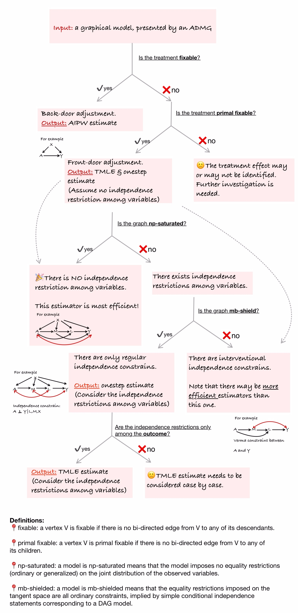
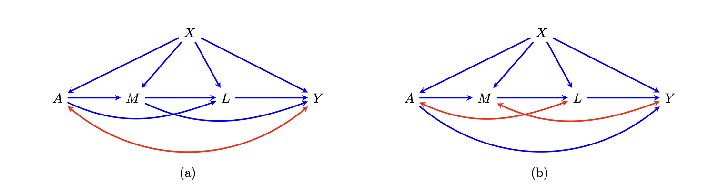

An R Package for Causal Effect Estimation and Inference in Graphical Models with
Unmeasured Variables
================

- [1 Introduction](#1-introduction)
- [2 Installation](#1-installation)
- [3 Quick Start](#2-quick-start)
- [4 Influence Function-Based Estimation via One-Step Correction and TMLE](#4-estimation-via-onestep-and-tmle)
  - [4.1 One-Step Corrected Plug-In Estimation](#41-onestep-estimator)
  - [4.2 Targeted Minimum Loss Based Estimation (TMLE)](#42-tmle)
- [5 Output](#5-output)
- [6 Properties of
  ADMGs](#6-properties-of-admgs)

# 1 Introduction

`flexCausal` is designed to estimate the Average Causal Effect (ACE) in directed acyclic graphs (DAGs) with 
latent, hidden, or unmeasured variables. By projecting these hidden variables, the package works within 
acyclic directed mixed graphs (ADMGs). This package implements novel estimators introduced in [this paper](http://www.arxiv.org/pdf/2409.03962), 
leveraging advanced methods from the theory of influence functions and targeted minimum loss-based estimation (TMLE). 
By providing robust causal estimates, `flexCausal` enables users to gain deeper insights into complex data structures where 
unmeasured confounding is a concern. 

Here’s a schematic view of what `flexCausal` is capable of:



If you find this package useful, please cite [this
paper:](http://www.arxiv.org/pdf/2409.03962)

``` r
@article{guo2024average,
  title={Average Causal Effect Estimation in DAGs with Hidden Variables: Extensions of Back-Door and Front-Door Criteria},
  author={Guo, Anna and Nabi, Razieh},
  journal={arXiv preprint arXiv:2409.03962},
  year={2024}
}
```

# 2 Installation

To install, run the following code in your R console:

``` bash 

# First, install the devtools package if it's not already installed
if (!requireNamespace("devtools", quietly = TRUE)) {
  install.packages("devtools")
}

# Then, install the flexCausal package from GitHub
devtools::install_github("annaguo-bios/flexCausal")
```

# 3 Quick Start

Consider the following ADMGs as illustrative examples: 



The main function in this package is `ADMGtmle()`, which estimates the 
Average Causal Effect (ACE) using both a one-step corrected plug-in estimator 
and a TMLE estimator. To get a sense of how to use this package, 
we provide a quick example below. 

``` r
library(flexCausal) # Load the flexCausal package
head(data_fig_4a) #  Take a look at a simulated dataset from Figure (a)
```

    ##           X          U A      M.1         M.2        L        Y
    ## 1 0.3101427  1.7731206 0 2.212362  0.82384893 6.504096 12.29970
    ## 2 0.5258710  2.2863894 1 3.537888 -0.19437648 5.093739 12.80111
    ## 3 0.8761728  3.8538852 1 3.482861  2.62160109 8.523622 20.74587
    ## 4 0.5238235  3.3955992 1 4.358015  0.09736324 6.749402 16.21100
    ## 5 0.6814022 -0.2004696 0 1.492628  3.47722466 5.169072 11.72904
    ## 6 0.4586764  1.2511704 1 4.754302  0.69655182 8.015109 17.11876

``` r
est <- ADMGtmle(a=c(1,0),data=data_fig_4a, vertices=c('A','M','L','Y','X'),
                bi_edges=list(c('A','Y')),
                di_edges=list(c('X','A'), c('X','M'), c('X','L'),c('X','Y'), c('M','Y'), c('A','M'), c('A','L'), c('M','L'), c('L','Y')),
                treatment='A', outcome='Y',
                multivariate.variables = list(M=c('M.1','M.2')))
```

    ## The treatment is not fixable but is primal fixable. Estimation provided via extended front-door adjustment.

    ## TMLE estimated ACE: 1.94; 95% CI: (1.31, 2.57) 
    ## Onestep estimated ACE: 1.94; 95% CI: (1.32, 2.56)

    ## 
    ##  The graph is nonparametrically saturated. Results from the one-step estimator and TMLE are provided, which are in theory the most efficient estimators.

The code above estimates the ACE of treatment $A$ on outcome $Y$,
defined as $E(Y^1)-E(Y^0)$, using the data `data_fig_4a` generated based
on Figure (a). The function `ADMGtmle()` takes the following arguments:

- `a`: a vector of length 2, specifying the values of treatment $A$ to
  compare. For example, `a=c(1,0)` compares causal effect under $A=1$
  verse $A=0$.
- `data`: a data frame containing the data.
- `vertices`: a vector of strings, specifying the names of all vertices
  in the ADMG.
- `bi_edges`: a list of bi-directed edges in the ADMG.
- `di_edges`: a list of directed edges in the ADMG. For example,
  `c('X','A')` specifies an edge from $X$ to $A$.
- `treatment`: a string, specifying the name of the treatment variable.
- `outcome`: a string, specifying the name of the outcome variable.
- `multivariate.variables`: a list of variables that are multivariate.
  For example, `list(M=c('M1','M2'))` specifies that $M$ is a
  multivariate variable with components $M1$ and $M2$.

# 4 Influence Function-Based Estimation via One-Step Correction and TMLE 

## 4.1 One-Step Corrected Plug-In Estimation

In implementing the onestep estimator, we use the trick of sequential
regression. For example, in the above example (a), the onestep estimator
involves a nuisance $E\left[E(Y|L, M,a_1,X)\right | M,a_0,X]$, where
$a_1=1-a$, $a_0=a$, and $a$ is the level of intervention of treatment
$A$. To estimate this nuisance, we would first fit a regression model of
$Y$ on $L, M, A, X$ to get and estimate $\hat{E}(Y|L, M,a_1,X)$ and then
fit a regression model of $\hat{E}(Y|L, M,a_1,X)$ on $L, M, A, X$. We
offer three options for the regression model: (1) via simple linear or
logistic regression, (2) via SuperLearner, and (3) via SuperLearner
together with cross-fitting. Below we elaborate on the three options:

- Option 1: Simple linear or logistic regression. The function offers
  `formulaY` and `formulaA` to specify the regression model for the
  outcome regression and propensity score regression, respectively. It
  further allow users to specify the link function for the outcome
  regression and propensity score regression via `linkY_binary` and
  `linkA`, respectively. Note that `linkY_binary` is only effective when
  the outcome is a binary variable.
- Option 2: SuperLearner. The function offers `superlearner.seq`,
  `superlearner.Y`, and `superlearner.A`, to specify whether to use
  SuperLearner for the sequential regression, outcome regression, and
  propensity score regression, respectively. The user can further
  specify the library of SuperLearner via `library.seq`, `library.Y`,
  `library.A`, respectively.
- Option 3: SuperLearner with cross-fitting. The function offers
  `crossfit` to specify whether to use cross-fitting in SuperLearner.
  The user can further specify the number of folds in cross-fitting via
  `K`. The library of SuperLearner is still specified via `library.seq`,
  `library.Y`, `library.A`, respectively.

The code below is an example of adopting SuperLearner with
cross-fitting:

``` r
est <- ADMGtmle(a=c(1,0),data=data_fig_4a, vertices=c('A','M','L','Y','X'),
                bi_edges=list(c('A','Y')),
                di_edges=list(c('X','A'), c('X','M'), c('X','L'),c('X','Y'), c('M','Y'), c('A','M'), c('A','L'), c('M','L'), c('L','Y')),
                treatment='A', outcome='Y',
                multivariate.variables = list(M=c('M1','M2')),
                lib.seq = c("SL.glm", "SL.earth", "SL.ranger", "SL.mean"),
                lib.Y = c("SL.glm", "SL.earth", "SL.ranger", "SL.mean"),
                lib.A = c("SL.glm", "SL.earth", "SL.ranger", "SL.mean"),
                crossfit = TRUE,
                K=5)
```

## 4.2 Targeted Minimum Loss Based Estimation (TMLE)

In implementing the TMLE estimator,apart from sequential regression, we
also need to estimate density ratios. For example, in the above example
(a), the TMLE estimator involves a nuisance $p(M|a_0,X)/p(M|a_1,X)$. We
need to estimate the density ratio for two sets of variables. Let $C$ be
the set of pre-treatment variables, let $L$ be the set of variables that
are connect with treatment $A$ via bidirected edges, and let $M$ be the
set of variables that is not in either $C$ or $L$. We need to estimate
the density ratio for variables in $L\backslash A,Y$ and
$M\backslash Y$. We offer three options for the density ratio
estimation: (1) via the package, (2) via Bayes rule, and (3) via
assuming normal distribution for continuous varialbes. Below we
elaborate on the three options:

- Option 1: The package. The function calls the package to estimate the
  density ratio for variables in $L\backslash A,Y$ or $M\backslash Y$ if
  `ratio.method.L="densratio"` or `ratio.method.M="densratio"`,
  respectively.
- Option 2: Bayes rule. The function estimates the density ratio for
  variables in $L\backslash A,Y$ or $M\backslash Y$ via Bayes rule if
  `ratio.method.L="bayes"` or `ratio.method.M="bayes"`, respectively.
  For example, the bayes rule method estimate $p(M|a_0,X)/p(M|a_1,X)$ by
  rewriting it as $[p(a_0|M,X)/p(a_1|M,X)]/[p(a_0|X)/p(a_1|X)]$.
  $p(A|M,X)$ is then estimated via the three options as discussed under
  the onestep estimator section. We use `superlearner.M` and
  `superlearner.L` to specify whether to use SuperLearner for the
  density ratio estimation for variables in $M\backslash Y$ and
  $L\backslash A,Y$, respectively. The user can further specify the
  library of SuperLearner via `lib.M` and `lib.L`, respectively.
- Option 3: Assuming normal distribution for continuous variables. The
  function estimates the density ratio for variables in
  $L\backslash A,Y$ or $M\backslash Y$ via assuming normal distribution
  if `ratio.method.L="dnorm"` or `ratio.method.M="dnorm"`, respectively.
  The mean of the normal distribution is estimated via linear
  regression, and the variance is estimated via the sample variance of
  the error term from the regression model. Note that we assume the
  linear regression only involve first order terms, and we do not
  consider interaction terms.

The code below is an example of using the `dnorm` method for the density
ratio estimation for variables in $M\backslash Y$:

``` r
est <- ADMGtmle(a=c(1,0),data=data_fig_4a, vertices=c('A','M','L','Y','X'),
                bi_edges=list(c('A','Y')),
                di_edges=list(c('X','A'), c('X','M'), c('X','L'),c('X','Y'), c('M','Y'), c('A','M'), c('A','L'), c('M','L'), c('L','Y')),
                treatment='A', outcome='Y',
                multivariate.variables = list(M=c('M1','M2')),
                ratio.method.M = "dnorm")
```

# 5 Output

As an example, we `ADMGtmle()` to estimate the average counterfactual
outcome $E(Y^1)$. The output is described as follows

``` r
est <- ADMGtmle(a=1,data=data_fig_4a, vertices=c('A','M','L','Y','X'),
                bi_edges=list(c('A','Y')),
                di_edges=list(c('X','A'), c('X','M'), c('X','L'),c('X','Y'), c('M','Y'), c('A','M'), c('A','L'), c('M','L'), c('L','Y')),
                treatment='A', outcome='Y',
                multivariate.variables = list(M=c('M1','M2')))

# TMLE and Onestep estimator
est$TMLE # a list contains the estimation result from TMLE estimator
est$Onestep # a list contains the estimation result from Onestep estimator

# For either the TMLE or Onestep estimator, the output is a list that contains the following elements:
est$TMLE$estimated_psi # the estimated average counterfactual outcome
est$TMLE$lower.ci # the lower bound of the 95% confidence interval
est$TMLE$upper.ci # the upper bound of the 95% confidence interval
est$TMLE$EIF # the estimated efficient influence function
est$TMLE$EIF.Y # the estimated efficient influence function at the tangent space associated with the outcome
est$TMLE$EIF.A # the estimated efficient influence function at the tangent space associated with the treatment
est$TMLE$EIF.v # the estimated efficient influence function at the tangent space associated with the rest of the variables
est$TMLE$p.a1.mpA # the estimated propensity score for treatment
est$TMLE$mu.next.A # the estimated sequential regression associated with variable that comes right after the treatment according to the topological ordering of the ADMG
est$TMLE$EDstar # mean of the estimated efficient influence function
est$TMLE$iter # iterations take for TMLE estimator to converge
est$TMLE$EDstar.record # the mean of the estimated efficient influence function at each iteration
```

# 6 Properties of ADMGs

Apart from the `ADMGtmle()` for causal effection estimation, we also
provide functions for learning the properties of ADMG. The functions are
described as follows:

- `make.graph`: create the graph object. For example, to create the
  graph object for the ADMG in Figure (a), we can use the following
  code:

``` r
graph <- make.graph(vertices=c('A','M','L','Y','X'),
bi_edges=list(c('A','Y')),
di_edges=list(c('X','A'), c('X','M'), c('X','L'),
c('X','Y'), c('M','Y'), c('A','M'), c('A','L'), c('M','L'), c('L','Y')))
```

- `f.adj_matrix`: return the adjacency matrix of the graph. For example,
  to get the adjacency matrix of the graph object for the ADMG in Figure
  (a), we can use the following code:

``` r
f.adj_matrix(graph)
```

- `f.top_order`: return the topological ordering of the graph.

``` r
f.top_order(graph)
```

- `f.parents`: return the parents of a given vertex or vertices in the
  graph. For example, to get the parents of vertex `Y` in the graph
  object for the ADMG in Figure (a), we can use the following code:

``` r
f.parents(graph, 'Y')
```

- `f.children`: return the children of a given vertex or vertices in the
  graph. For example, to get the children of vertex `A` in the graph
  object for the ADMG in Figure (a), we can use the following code:

``` r
f.children(graph, 'A')
```

- `f.descendants`: return the descendants of a given vertex or vertices
  in the graph. For example, to get the descendants of vertex `A` in the
  graph object for the ADMG in Figure (a), we can use the following
  code:

``` r
f.descendants(graph, 'A')
```

- `f.district`: return the district of a given vertex or vertices in the
  graph. For example, to get the district of vertex `A` in the graph
  object for the ADMG in Figure (a), we can use the following code:

``` r
f.district(graph, 'A')
```

- `cnt.districts`: return the number of districts in the graph.

``` r
cnt.districts(graph)
```

- `f.markov_blanket`: return the Markov blanket of a given vertex or
  vertices in the graph. For example, to get the Markov blanket of
  vertex `A` in the graph object for the ADMG in Figure (a), we can use
  the following code:

``` r
f.markov_blanket(graph, 'A')
```

- `f.markov_pillow`: return the Markov pillow of a given vertex or
  vertices in the graph. For example, to get the Markov pillow of vertex
  `A` in the graph object for the ADMG in Figure (a), we can use the
  following code:

``` r
f.markov_pillow(graph, 'A')
```

- `is.p.fix`: return whether a treatment variable is primal fixable in a
  graph object. For example, to check whether the treatment variable `A`
  is primal fixable in the graph object for the ADMG in Figure (a), we
  can use the following code:

``` r
is.p.fix(graph, 'A')
```

If the treatment is primal fixable, then the average causal effect of
the treatment on any choice of the outcome in the given graph is always
identified.

- `is.np.saturated`: return whether a graph object is NP-saturated. For
  example, to check whether the graph object for the ADMG in Figure (a)
  is NP-saturated, we can use the following code:

``` r
is.np.saturated(graph)
```

A graph being nonparametrically saturated means that the graph implies
NO equality constraints on the observed data distribution.

- `is.mb.shielded`: return whether a graph is mb-shielded. For example,
  to check whether ADMG in Figure (a) is shielded, we can use the
  following code:

``` r
is.mb.shielded(graph)
```

A graph being mb-shielded means that the graph only implies ordinary
equality constraints on the observed data distribution.

## <a id="References"></a>References
- [Guo et al. 2023] Guo, A., Benkeser, D., & Nabi, R. **Targeted Machine Learning for Average Causal Effect Estimation Using the Front-Door Functional.** arXiv preprint arXiv:2312.10234, 2023. 
- [Guo and Nabi. 2024] Guo, A.& Nabi, R. **Average Causal Effect Estimation in DAGs with Hidden Variables: Extensions of Back-Door and Front-Door Criteria.** arXiv preprint arXiv:2409.03962, 2024. 


