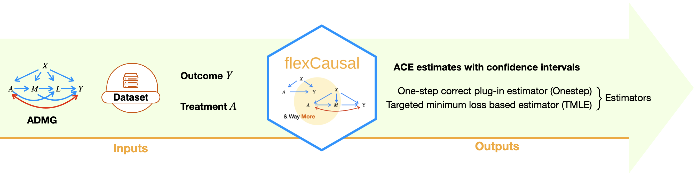
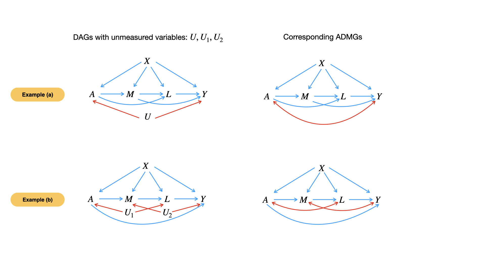

The `flexCausal` R package enables estimation of Average Causal Effects (ACE) for a broad class of graphical models that satisfy the treatment primal fixability criterion. Briefly, the package accepts a dataset and a causal graph—defined through nodes, directed edges, and bi-directed edges—as input and provides causal effect estimates using robust influence-function-based estimators developed in [this paper](http://www.arxiv.org/pdf/2409.03962).

{width=100%}


> The package asks for the following **inputs** from the user:  
> 
>- Dataset
>
>- Treatment and outcome specifications
>
>- ADMG (acyclic directed mixed graph), a projection of directed acyclic graphs (DAG) with latent variables. This can be based on expert knowledge, causal discovery methods, or a combination of both.

  
  
> The package **outputs**:  
> 
>- Whether the causal effect is identifiable
>
>- The estimated causal effect with confidence intervals (if the causal effect is identifiable under primal fixability criterion). Users can specify either one-step or TMLE estimators, or choose to use both.
> Additionally, they can select methods for nuisance parameter estimation, with SuperLearner set as the default.
>
>- An assessment of whether the specified ADMG is nonparametrically saturated, and if current estimates reach the semiparametric efficiency bounds.

Here's a schematic view of what `flexCausal` is capable of and how it works:


{width=80%}


If you find this package useful, please cite: [this paper](http://www.arxiv.org/pdf/2409.03962)
```{r, eval=FALSE, citation}
@article{guo2024average,
  title={Average Causal Effect Estimation in DAGs with Hidden Variables: Extensions of Back-Door and Front-Door Criteria},
  author={Guo, Anna and Nabi, Razieh},
  journal={arXiv preprint arXiv:2409.03962},
  year={2024}
}
```

# Installation
To install, run the following code in terminal:

```{bash, eval = FALSE}
# install the devtools package first if it's not yet installed
devtools::install_github("annaguo-bios/flexCausal")
```

The source code for `flexCausal` package is available on GitHub at [flexCausal](https://github.com/annaguo-bios/flexCausal/tree/main).

# A Brief Introduction to ADMGs
The ADMG is one of the major input to the `flexCausal` package. It is a projection of a Directed Acyclic Graph (DAG) with unmeasured variables into only observed variables. Let $G(O \cup U)$ denote a DAG with observed variables $O$ and unmeasured variables $U$. The ADMG is a projection of $G(O \cup U)$ onto $O$ only, denoted as $G(O)$. The projection is guided by the following rules:
  
1. $O_i \ \blue{\rightarrow} \ O_j$ is included in the ADMG $G(O)$ if $O_i \ \blue{\rightarrow} \ O_j$ exists in $G(O \cup U)$ or if a directed path from $O_i$ to $O_j$ exists that passes through only unmeasured variables in $G(O \cup U)$.
2. $V_i \ \red{\leftrightarrow} \ V_j$ is included in the ADMG $G(O)$ if a collider-free path, like $V_i \ \blue{\leftarrow} \cdots \blue{\rightarrow} \ V_j$, exists in $G(O \cup U)$ where all the intermediate variables belong to $U$.

See Examples (a) and (b), where the DAGs with unmeasured variables on the left are projected onto their corresponding ADMGs on the right:
{width=100%}

In all the following discussions, we will use the ADMG in example (a) above as a running example. The packages comes with simulated datasets `data_example_a` and `data_example_b` that are generated from the ADMGs in examples (a) and (b), respectively. Let’s take a look at the first few rows of `data_example_a`:

```{r, load-pkg, warning=F, message=F}

library(flexCausal) # load the package

head(data_example_a) # take a glance of the data, which is a simulated dataset under above figure (a).

```

Note that the $M$ variable in the dataset is a multivariate variable, consisting of two components, $M.1$ and $M.2$. To input the ADMG into the `flexCausal` package, users need to specify the *vertices*, *directed edges*, and *bi-directed edges* in the ADMG, along with the components of any *multivariate variables*.  

For example, to input the ADMG in example (a) above that aligns with the simulated dataset, we would create a graph object with the `make.graph()` function:

```{r, eval=T, warning=F, message=F}

# create a graph object for the ADMG in example (a)
graph_a <- make.graph(vertices=c('A','M','L','Y','X'), # specify the vertices
                bi_edges=list(c('A','Y')), # specify the bi-directed edges
                di_edges=list(c('X','A'), c('X','M'), c('X','L'),c('X','Y'), c('M','Y'), c('A','M'), c('A','L'), c('M','L'), c('L','Y')), # specify the directed edges, with each pair of variables indicating an directed edge from the first variable to the second. For example, c('X', 'A') represents a directed edge from X to A.
                multivariate.variables = list(M=c('M.1','M.2'))) # specify the components of the multivariate variable M

```

With this graph object in hand, we can conveniently explore various properties of the ADMG using functions provided in the package. These functions include topological ordering, genealogical relations, and causal effect identifiability, and etc. For a detailed discussion, see [Functions for learning the properties of ADMG]. 

As a quick example, we can obtain the adjacency matrix of this ADMG with the `f.adj_matrix()` function:

```{r, eval=T, warning=F, message=F}

f.adj_matrix(graph_a) # get the adjacency matrix of the ADMG in example (a)

```


# Quick Start on Estimation

The main function in this package is `ADMGtmle()`, which estimates the Average Causal Effect (ACE) using both a one-step corrected plug-in estimator and a TMLE estimator. To get a sense of how to use this package, we provide a quick example below. We will use the ADMG in example (a) above to estimate the ACE of treatment $A$ on outcome $Y$ using a simulated dataset `data_example_a`. We can directly use the `graph_a` object created above as the input to the function.

```{r, quick-start, warning=F, message=T}

est <- ADMGtmle(a=c(1,0),
                data=data_example_a, 
                graph=graph_a,
                treatment='A', outcome='Y')
```

The code above estimates the ACE of treatment $A$ on outcome $Y$, defined as $E(Y^1)-E(Y^0)$, using the data `data_example_a` generated based on Figure (a). The function `ADMGtmle()` takes the following arguments:
  
- `a`: a vector of length 2, specifying the values of treatment $A$ to compare. For example, `a=c(1,0)` compares causal effect under $A=1$ verse $A=0$. Alternatively, `a` can be input as a single integer if estimating the causal effect under only one treatment level is the goal. For example, to estimate $E(Y^1)$, specify `a = 1`.
- `data`: a data frame containing the data.
- `graph`: a graph object specifying the ADMG.
- `treatment`: a string, specifying the name of the treatment variable.
- `outcome`: a string, specifying the name of the outcome variable.


Alternatively, instead of providing a graph object, users can directly specify the vertices, directed edges, and bi-directed edges within the ADMGtmle() function, as shown below:

```{r, quick-start-option2, warning=F, message=T}

est <- ADMGtmle(a=c(1,0),data=data_example_a, 
                vertices=c('A','M','L','Y','X'), # specify the vertices
                bi_edges=list(c('A','Y')), # specify the bi-directed edges
                di_edges=list(c('X','A'), c('X','M'), c('X','L'),c('X','Y'), c('M','Y'), c('A','M'), c('A','L'), c('M','L'), c('L','Y')), # specify the directed edges
                multivariate.variables = list(M=c('M.1','M.2')), # specify the components of the multivariate variable M
                treatment='A', outcome='Y')
```

# Details on Estimation via TMLE estimator and onestep estimator

## The Onestep Estimator
In implementing the onestep estimator, we use the trick of sequential regression. For example, in the above example (a), the onestep estimator involves a nuisance $E\left[E(Y|L, M,a_1,X)\right | M,a_0,X]$, where $a_1=1-a$, $a_0=a$, and $a$ is the level of intervention of treatment $A$. To estimate this nuisance, we would first fit a regression model of $Y$ on $L, M, A, X$ to get and estimate $\hat{E}(Y|L, M,a_1,X)$ and then fit a regression model of $\hat{E}(Y|L, M,a_1,X)$ on $L, M, A, X$. We offer three options for the regression model: (1) via simple linear or logistic regression, (2) via SuperLearner, and (3) via SuperLearner together with cross-fitting. Below we elaborate on the three options:
  
- Option 1: Simple linear or logistic regression. The function offers `formulaY` and `formulaA` to specify the regression model for the outcome regression and propensity score regression, respectively. It further allow users to specify the link function for the outcome regression and propensity score regression via `linkY_binary` and `linkA`, respectively. Note that `linkY_binary` is only effective when the outcome is a binary variable.
- Option 2: SuperLearner. The function offers `superlearner.seq`, `superlearner.Y`, and `superlearner.A`, to specify whether to use SuperLearner for the sequential regression, outcome regression, and propensity score regression, respectively. The user can further specify the library of SuperLearner via `library.seq`, `library.Y`, `library.A`, respectively.
- Option 3: SuperLearner with cross-fitting. The function offers `crossfit` to specify whether to use cross-fitting in SuperLearner. The user can further specify the number of folds in cross-fitting via `K`. The library of SuperLearner is still specified via `library.seq`, `library.Y`, `library.A`, respectively.

The code below is an example of adopting SuperLearner with cross-fitting:

```{r, onestep-eg, warning=F, message=F, eval=F}

est <- ADMGtmle(a=c(1,0),
                data=data_example_a, 
                graph = graph_a,
                lib.seq = c("SL.glm", "SL.earth", "SL.ranger", "SL.mean"),
                lib.Y = c("SL.glm", "SL.earth", "SL.ranger", "SL.mean"),
                lib.A = c("SL.glm", "SL.earth", "SL.ranger", "SL.mean"),
                crossfit = TRUE,
                K=5)
```

## The TMLE
In implementing the TMLE estimator,apart from sequential regression, we also need to estimate density ratios. For example, in the above example (a), the TMLE estimator involves a nuisance $p(M|a_0,X)/p(M|a_1,X)$. We need to estimate the density ratio for two sets of variables. Let $C$ be the set of pre-treatment variables, let $L$ be the set of variables that are connect with treatment $A$ via bidirected edges, and let $M$ be the set of variables that is not in either $C$ or $L$. We need to estimate the density ratio for variables in $L\backslash A,Y$ and $M\backslash Y$. We offer three options for the density ratio estimation: (1) via the \link[densratio]{densratio} package, (2) via Bayes rule, and (3) via assuming normal distribution for continuous varialbes. Below we elaborate on the three options:
 
- Option 1: The \link[densratio]{densratio} package. The function calls the \link[densratio]{densratio} package to estimate the density ratio for variables in $L\backslash A,Y$ or $M\backslash Y$ if `ratio.method.L="densratio"` or `ratio.method.M="densratio"`, respectively.
- Option 2: Bayes rule. The function estimates the density ratio for variables in $L\backslash A,Y$ or $M\backslash Y$ via Bayes rule if `ratio.method.L="bayes"` or `ratio.method.M="bayes"`, respectively. For example, the bayes rule method estimate $p(M|a_0,X)/p(M|a_1,X)$ by rewriting it as $[p(a_0|M,X)/p(a_1|M,X)]/[p(a_0|X)/p(a_1|X)]$. $p(A|M,X)$ is then estimated via the three options as discussed under the onestep estimator section. We use `superlearner.M` and `superlearner.L` to specify whether to use SuperLearner for the density ratio estimation for variables in $M\backslash Y$ and $L\backslash A,Y$, respectively. The user can further specify the library of SuperLearner via `lib.M` and `lib.L`, respectively.
- Option 3: Assuming normal distribution for continuous variables. The function estimates the density ratio for variables in $L\backslash A,Y$ or $M\backslash Y$ via assuming normal distribution if `ratio.method.L="dnorm"` or `ratio.method.M="dnorm"`, respectively. The mean of the normal distribution is estimated via linear regression, and the variance is estimated via the sample variance of the error term from the regression model. Note that we assume the linear regression only involve first order terms, and we do not consider interaction terms.

The code below is an example of using the `dnorm` method for the density ratio estimation for variables in $M\backslash Y$:

```{r, tmle-eg, warning=F, message=F, eval=F}

est <- ADMGtmle(a=c(1,0),
                data=data_example_a, 
                graph = graph_a,
                ratio.method.M = "dnorm")
```

# Output
As an example, we `ADMGtmle()` to estimate the average counterfactual outcome $E(Y^1)$. The output is described as follows

```{r, output, eval=F}

est <- ADMGtmle(a=1,
                data=data_example_a, 
                graph = graph_a,
                treatment='A', outcome='Y')

# TMLE and Onestep estimator
est$TMLE # a list contains the estimation result from TMLE estimator
est$Onestep # a list contains the estimation result from Onestep estimator

# For either the TMLE or Onestep estimator, the output is a list that contains the following elements:
est$TMLE$estimated_psi # the estimated average counterfactual outcome
est$TMLE$lower.ci # the lower bound of the 95% confidence interval
est$TMLE$upper.ci # the upper bound of the 95% confidence interval
est$TMLE$EIF # the estimated efficient influence function
est$TMLE$EIF.Y # the estimated efficient influence function at the tangent space associated with the outcome
est$TMLE$EIF.A # the estimated efficient influence function at the tangent space associated with the treatment
est$TMLE$EIF.v # the estimated efficient influence function at the tangent space associated with the rest of the variables
est$TMLE$p.a1.mpA # the estimated propensity score for treatment
est$TMLE$mu.next.A # the estimated sequential regression associated with variable that comes right after the treatment according to the topological ordering of the ADMG
est$TMLE$EDstar # mean of the estimated efficient influence function
est$TMLE$iter # iterations take for TMLE estimator to converge
est$TMLE$EDstar.record # the mean of the estimated efficient influence function at each iteration

```

# Functions for learning the properties of ADMG
Apart from the `ADMGtmle()` for causal effec estimation, we also provide functions for learning the properties of ADMG. The functions are described as follows:
  
- `make.graph`: create the graph object. For example, to create the graph object for the ADMG in Figure (a), we can use the following code:

```{r, make-graph, warning=F, message=F, eval=F}

graph_a <- make.graph(vertices=c('A','M','L','Y','X'), # specify the vertices
                bi_edges=list(c('A','Y')), # specify the bi-directed edges
                di_edges=list(c('X','A'), c('X','M'), c('X','L'),c('X','Y'), c('M','Y'), c('A','M'), c('A','L'), c('M','L'), c('L','Y')), # specify the directed edges, with each pair of variables indicating an directed edge from the first variable to the second. For example, c('X', 'A') represents a directed edge from X to A.
                multivariate.variables = list(M=c('M.1','M.2'))) # specify the components of the multivariate variable M

```

- `f.adj_matrix`: return the adjacency matrix of the graph. For example, to get the adjacency matrix of the graph object for the ADMG in Figure (a), we can use the following code:

```{r, f-adj-matrix, warning=F, message=F, eval=F}
f.adj_matrix(graph_a)
```

- `f.top_order`: return the topological ordering of the graph.

```{r, f-top-order, warning=F, message=F, eval=F}
f.top_order(graph_a)
```

- `f.parents`: return the parents of a given vertex or vertices in the graph. For example, to get the parents of vertex `Y` in the graph object for the ADMG in Figure (a), we can use the following code:

```{r, f-parents, warning=F, message=F, eval=F}
f.parents(graph_a, 'Y')
```

- `f.children`: return the children of a given vertex or vertices in the graph. For example, to get the children of vertex `A` in the graph object for the ADMG in Figure (a), we can use the following code:

```{r, f-children, warning=F, message=F, eval=F}
f.children(graph_a, 'A')

```

- `f.descendants`: return the descendants of a given vertex or vertices in the graph. For example, to get the descendants of vertex `A` in the graph object for the ADMG in Figure (a), we can use the following code:

```{r, f-descendants, warning=F, message=F, eval=F}
f.descendants(graph_a, 'A')

```

- `f.district`: return the district of a given vertex or vertices in the graph. For example, to get the district of vertex `A` in the graph object for the ADMG in Figure (a), we can use the following code:

```{r, f-district, warning=F, message=F, eval=F}
f.district(graph_a, 'A')

```

- `cnt.districts`: return the number of districts in the graph.

```{r, cnt-districts, warning=F, message=F, eval=F}
cnt.districts(graph_a)

```

- `f.markov_blanket`: return the Markov blanket of a given vertex or vertices in the graph. For example, to get the Markov blanket of vertex `A` in the graph object for the ADMG in Figure (a), we can use the following code:

```{r, f-markov-blanket, warning=F, message=F, eval=F}
f.markov_blanket(graph_a, 'A')

```

- `f.markov_pillow`: return the Markov pillow of a given vertex or vertices in the graph. For example, to get the Markov pillow of vertex `A` in the graph object for the ADMG in Figure (a), we can use the following code:

```{r, f-markov-pillow, warning=F, message=F, eval=F}
f.markov_pillow(graph_a, 'A')

```

- `is.p.fix`: return whether a treatment variable is primal fixable in a graph object. For example, to check whether the treatment variable `A` is primal fixable in the graph object for the ADMG in Figure (a), we can use the following code:

```{r, is-p-fix, warning=F, message=F, eval=F}
is.p.fix(graph_a, 'A')
```

If the treatment is primal fixable, then the average causal effect of the treatment on any choice of the outcome in the given graph is always identified.

- `is.np.saturated`: return whether a graph object is NP-saturated. For example, to check whether the graph object for the ADMG in Figure (a) is NP-saturated, we can use the following code:

```{r, is-np-saturated, warning=F, message=F, eval=F}
is.np.saturated(graph_a)

```

A graph being nonparametrically saturated means that the graph implies NO equality constraints on the observed data distribution.

- `is.mb.shielded`: return whether a graph is mb-shielded. For example, to check whether ADMG in Figure (a) is shielded, we can use the following code:

```{r, is-mb-shielded, warning=F, message=F, eval=F}
is.mb.shielded(graph_a)

```

A graph being mb-shielded means that the graph only implies ordinary equality constraints on the observed data distribution.
